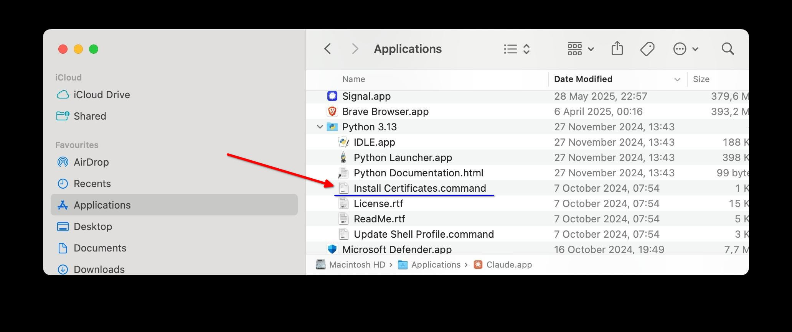

[](https://mseep.ai/app/andybrandt-mcp-simple-pubmed)

# MCP Simple PubMed
[](https://smithery.ai/server/mcp-simple-pubmed)

An MCP server that provides access to PubMed articles through the Entrez API.

<a href="https://glama.ai/mcp/servers/5wlfb8i6bj"></a>

## Features

- Search PubMed database using keywords
- Access article abstracts
- Download full text when available (for open access articles available directly on PubMed) 

Please note that the tool returns XML-ized version of full text. It is however more useful for AIs than a "human readable" text would have been as it gives them additional information about document's structure. At least, this is what Claude 3.5 Sonnet said he prefers. 

Please also note that inability of this tool and possibly other tools to deliver a paper's full text may not be due to the fact that it is not available. When testing this tool I came across a paper that did not have full text on PubMed and when Claude accessed the publication URL (which we did get through DOI) using fetch he did get a "forbidden” error. However, I was able to access the very same page using a regular browser. 

In other words if your AI assistant is not able to get the full text of a paper using this tool it is worth trying manually with a regular web browser.

Finally, this tool of course can’t give you access to paywalled/paid papers. You may be able to read them through your library access or – as a last resort – through a certain site that strives to make publicly funded research freely available. 

## Installation

### Installing via Smithery

To install Simple PubMed for Claude Desktop automatically via [Smithery](https://smithery.ai/server/mcp-simple-pubmed):

```bash
npx -y @smithery/cli install mcp-simple-pubmed --client claude
```

### Manual Installation
```bash
pip install mcp-simple-pubmed
```

## Configuration

The server requires the following environment variables:

- `PUBMED_EMAIL`: Your email address (required by NCBI)
- `PUBMED_API_KEY`: Optional API key for higher rate limits 

The standard rate limit is 3 requests / second. No rate limiting was implemented, as it is highly unlikely in the typical usage scenario that your AI would generate more traffic. If you need it, you can [register for an API key](https://www.ncbi.nlm.nih.gov/account/) which will give you 10 requests / second. Read about [this on NCBI pages](https://www.ncbi.nlm.nih.gov/books/NBK25497/#chapter2.Usage_Guidelines_and_Requiremen).

## Usage with Claude Desktop

Add to your Claude Desktop configuration (`claude_desktop_config.json`):

(Mac OS)

```json
{
  "mcpServers": {
    "simple-pubmed": {
      "command": "python",
      "args": ["-m", "mcp_simple_pubmed"],
      "env": {
        "PUBMED_EMAIL": "your-email@example.com",
        "PUBMED_API_KEY": "your-api-key" 
      }
    }
  }
}
```

(Windows)


```json
{
  "mcpServers": {
    "simple-pubmed": {
      "command": "C:\\Users\\YOUR_USERNAME\\AppData\\Local\\Programs\\Python\\Python311\\python.exe",
      "args": [
        "-m",
        "mcp_simple_pubmed"
      ],
      "env": {
        "PUBMED_EMAIL": "your-email@example.com",
        "PUBMED_API_KEY": "your-api-key" 
      }
    }
  }
}
```

### macOS SSL Certificate Fix

If you encounter SSL certificate verification errors on macOS (such as `[SSL: CERTIFICATE_VERIFY_FAILED] certificate verify failed: self-signed certificate in certificate chain`), you need to install the proper certificate bundle:

```bash
/Applications/Python\ 3.13/Install\ Certificates.command
```
Replace `3.13` with your Python version number. This script comes with Python installations from python.org.

You can also run it from the Finder:




## License

MIT License
